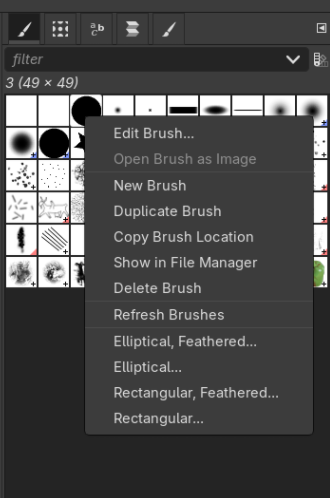
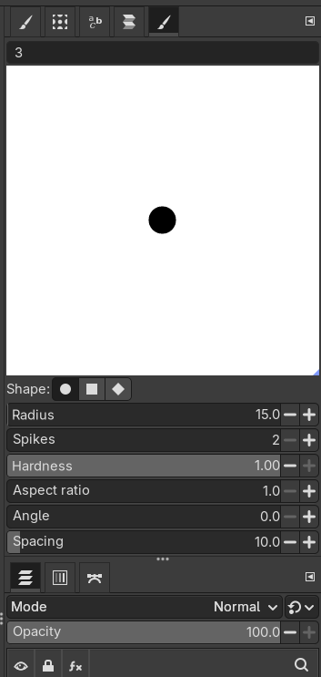
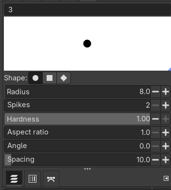

# Slide Specifications

## 📐 Dimensions & Resolution
Modern PowerPoint slides are standardized to **4K** resolution. This is the standard regardless of the physical viewing size of the slide.

*   **Pixel Dimensions:** 3840 × 2160 pixels
*   **Physical Dimensions:** 13.333 × 7.5 inches
*   **Base DPI:** 288 dpi

> **Note:** PowerPoint switched from Full HD (1920x1080) to 4K (3840x2160) approximately 8 years ago.

## 🖼️ Image Quality Guidelines
Resolution requirements are flexible depending on the image content. Use these guidelines as "rules of thumb" rather than strict laws.

| Metric | Status | Description |
| :--- | :--- | :--- |
| **144 - 288 DPI** | ✅ **Recommended** | Looks great at 100% size. |
| **< 144 DPI** | ⚠️ **Risky** | May look blurry, especially with text. |
| **> 288 DPI** | 🚫 **Overkill** | Unnecessary unless specifically enlarging the image. |

**General Rule:**
*   High resolution does not guarantee sharpness (images can still be blurry).
*   Some images look passable even at lower resolutions (e.g., 72 dpi), but text-heavy images should stick to the higher range.

## 🛠️ This project setup

### Gimp
When setting up the file, adhere to the following configuration settings:

*   **Background Color:** `#1a1a1a`
*   **Image Size:** 3125 × 1400 pixels
*   **Text Style:** Roboto Bold (100 px)
*   **Paintbrush Settings:**
    *   **Type of paintbrush:**

        
    *   **Drawings:**

        
    *   **Text:**

                

### Excalidraw
When setting up the file, adhere to the following configuration settings:

*   **Background Color:** rgb("#1a1a1a)
*   **Primary fill:** rgb("#ffffff)
*   **Highlight colors:** rgb("#ff0000"), rgb("#fff400"), and rgb("#00c2ff")
*   **Frame settings:** 1041W × 466H
*   **Export settings:** Scale 3x
*   **Text Style:** Excalifront
